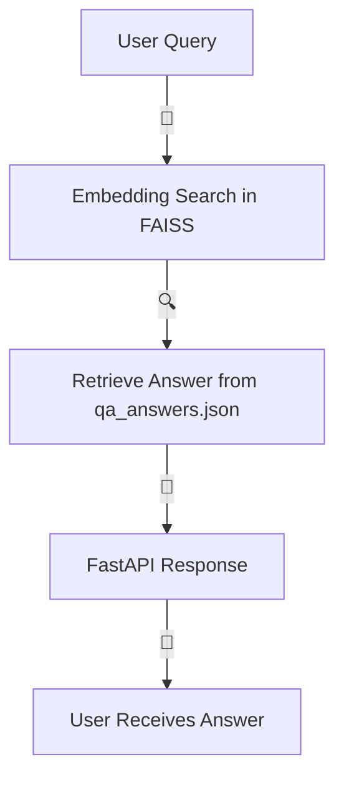

# 🌡️ Medical Chatbot – Powered by FAISS 🚀

Welcome to the **Medical Chatbot**, a blazing-fast, AI-powered solution that uses **FAISS** for lightning-speed semantic searches over a custom medical dataset. This project combines a **Jupyter Notebook** for generating embeddings with a sleek **FastAPI** backend to deliver instant, accurate, and visually captivating responses.

-----

## 📂 Project Structure

```
medical-chatbot/
├── app/                     🌐 FastAPI Backend
│   ├── main.py              # 🚀 Entry point for the API server
│   ├── model/               # 🧠 Stores FAISS index and answers
│   │   ├── index.faiss      # FAISS vector index
│   │   └── qa_answers.json  # Corresponding answer mappings
├── embeddings/              📚 Embedding Generation
│   └── generate_embeddings.ipynb  # Notebook to create FAISS index
├── requirements.txt         # 📦 Project dependencies
├── .gitattributes           # 🔧 Git LFS configuration
└── README.md                # 📜 You're here!
```

-----

## 🚀 Launch the Chatbot in 6 Steps

Follow these steps to get the medical chatbot up and running in no time.

### 1️⃣ Clone the Repo

Get started by cloning the project to your local machine:

```bash
git clone https://github.com/khuramshahz/medical-chatbot_FAISS.git
cd medical-chatbot_FAISS
```

### 2️⃣ Install Dependencies

It's a good practice to set up a virtual environment first.

```bash
# Optional: create a virtual environment
python -m venv env

# Activate the virtual environment
# For macOS/Linux:
source env/bin/activate
# For Windows:
env\Scripts\activate
```

Next, install the required packages:

```bash
pip install -r requirements.txt
```

Finally, enable **Git LFS** to handle the large FAISS file:

```bash
git lfs install
```

### 3️⃣ Generate Embeddings

This step creates the FAISS index and the corresponding answer file.

```bash
cd embeddings
jupyter notebook generate_embeddings.ipynb
```

Run all the cells in the notebook. This will generate two critical files:

  - **🌟 `index.faiss`**: The vector index for semantic search.
  - **📝 `qa_answers.json`**: The JSON file that maps vectors to their corresponding medical answers.

### 4️⃣ Move Files to `model/`

Now, move the generated files from the `embeddings` folder to the `app/model` folder.

```bash
cp index.faiss ../app/model/
cp qa_answers.json ../app/model/
```

### 5️⃣ Launch the Backend

Navigate to the `app` directory and start the FastAPI server.

```bash
cd ../app
python main.py
```

Look for this message to confirm the server is running:

```
✨ Uvicorn running on http://127.0.0.1:8000
```

### 6️⃣ Test the Chatbot

Your medical chatbot is now live\!

  - **Visit the API**: 🌐 `http://127.0.0.1:8000`
  - **Explore the interactive Swagger UI**: 📚 `http://127.0.0.1:8000/docs`

From the Swagger UI, you can send medical questions and watch the chatbot return accurate, relevant answers.

-----

## 🎨 Animated Workflow

This is how the chatbot works its magic:



-----

## 💡 Pro Tips

  - **Git LFS** is crucial for handling the large `index.faiss` file. Make sure it's properly installed and configured.
  - **Extend the Magic**:
      - Add a vibrant web frontend with **React** or **Vue** to create a polished user interface. 🖥️
      - Integrate a voice interface for hands-free queries. 🎙️
      - Upgrade the system with more advanced **NLP models** for deeper insights and more nuanced conversations. 🧠

-----

## 📜 License

This project is licensed under the **MIT License**. Feel free to use, modify, and distribute it. See the `LICENSE` file for more details.

-----

## 📬 Get in Touch

Have an idea to make this chatbot even better? Feel free to reach out to Khuram Shahzad or open an issue on GitHub\! 🌟
